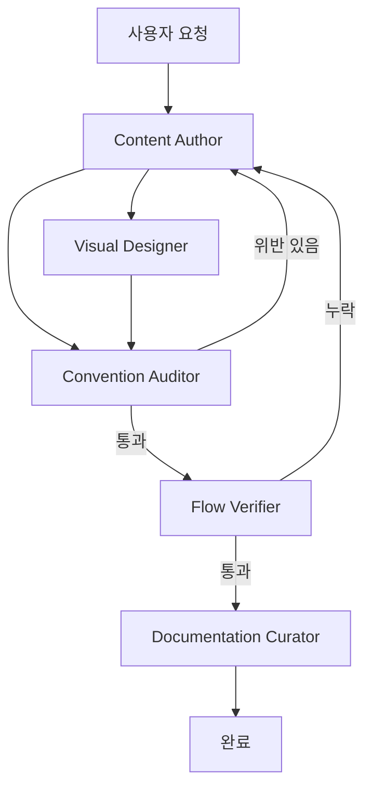

# PLUGINS-AND-AGENTS.md

> Spring 기초 과정 사이트의 외부 도구·플러그인·에이전트 분업 설계서. 이 문서는 학생용 산출물이 아니라 **운영자(강사·콘텐츠 작성자) 전용** 작업 문서입니다.

---

## 0. 이 문서를 읽는 순서

1. 「현재 사용 중인 도구」 — 지금 손에 쥔 것
2. 「추가 도입 가치 있는 플러그인」 — 다음 차시에 써볼 것
3. 「이미지·시각화 외부 서비스」 — 도식과 사진 출처
4. 「에이전트 단위 작업 분담 설계」 — 누가 무엇을 맡는가
5. 「워크플로 시나리오」 — 실제 호출 순서
6. 「CX 체크리스트」 — 학생 입장에서 통과 여부

---

## 1. 현재 사용 중인 도구

### 1.1 폰트·타이포그래피

| 자리 | 폰트 | 출처 |
|------|------|------|
| 본문 한국어 | **Pretendard** | `cdn.jsdelivr.net/gh/orioncactus/pretendard/dist/web/static/pretendard.css` |
| 코드 블록 | **JetBrains Mono** | `cdn.jsdelivr.net/gh/JetBrains/JetBrainsMono/css/jetbrains-mono.css` |
| 영문 헤드라인 | **Plus Jakarta Sans** | `fonts.googleapis.com/css2?family=Plus+Jakarta+Sans` |

### 1.2 슬라이드 프레임워크

- **reveal.js 5.1.0** (theme: night)
- 활성 플러그인:
  - `RevealHighlight` — 코드 하이라이트 (highlight.js 기반)
  - `RevealNotes` — 강사 노트 (S 키)

### 1.3 자체 제작 자산

| 파일 | 역할 |
|------|------|
| `js/screenshot.js` | 관리자(?key=...) 모드에서 슬라이드/예제에 이미지 첨부 — 로컬 스토리지 기반 |
| `js/infographics.js` | 12종 SVG 인포그래픽(흐름도, IoC 비유, 세션·쿠키, BCrypt 자물쇠 등) 인라인 렌더 |
| `images/` | 정적 이미지 |
| `api/` | 일부 동적 fetch 대상 (정적 JSON) |

### 1.4 빌드 시스템

**없음.** 정적 HTML + CDN. 로컬 미리보기 한 줄:

```bash
$ python3 -m http.server 8000
```

이 점이 의사결정에 큰 영향을 줍니다 — 모든 신규 도구는 **CDN 한 줄로 들어와야** 합니다. npm·webpack·vite는 도입하지 않습니다.

---

## 2. 추가 도입 가치 있는 플러그인 — 우선순위별

### ★★★ 상 (즉시 도입 권장)

#### 2.1 reveal.js-mermaid-plugin

- **출처**: <https://github.com/RajaRakoto/reveal.js-mermaid-plugin>
- **무엇을 풀어주는가**: Mermaid 코드 한 덩어리만 적으면 슬라이드 안에서 흐름도·시퀀스·ER 다이어그램이 자동 렌더. 지금은 모든 흐름도를 손으로 쓴 텍스트(`[Controller]→[Service]→...`)나 SVG 인포그래픽으로 그림. 시퀀스 다이어그램(예: 로그인 시 브라우저↔서버 왕복)을 그릴 때 손해가 큼.
- **CLAUDE.md 와의 정렬**: 모든 차시 끝에 「흐름도 슬라이드」를 강제하는 컨벤션이 있으므로, **흐름도 표준 출력 채널**이 될 수 있음.

**설치 (CDN)**:

```html
<!-- <head> 안 -->
<script src="https://cdn.jsdelivr.net/npm/mermaid/dist/mermaid.min.js"></script>
<script src="https://cdn.jsdelivr.net/gh/RajaRakoto/reveal.js-mermaid-plugin/plugin/mermaid/mermaid.js"></script>
```

**Reveal 초기화 통합**:

```js
Reveal.initialize({
  hash: true,
  plugins: [ RevealHighlight, RevealNotes, RevealMermaid ],
  mermaid: {
    theme: 'dark',
    sequence: { actorMargin: 80 },
    flowchart: { htmlLabels: true }
  }
});
```

**슬라이드 사용 예 — v3 안전한 로그인 흐름**:

```html
<section>
  <h2>흐름도 — 이번 차시에서 새로 생긴 칸</h2>
  <pre class="mermaid">
    sequenceDiagram
      participant 손님 as 브라우저
      participant 안내 as DispatcherServlet
      participant 종업원 as LoginController
      participant 셰프 as MemberService
      participant 통역 as Mapper
      참여자 DB
      손님->>안내: POST /login (id, raw pw)
      안내->>종업원: 호출
      종업원->>셰프: login(id, raw)
      셰프->>통역: findById(id)
      통역->>DB: SELECT
      DB-->>통역: row(hash)
      통역-->>셰프: Member
      셰프->>셰프: BCrypt.matches(raw, hash)
      셰프-->>종업원: ok
      종업원-->>손님: 302 + 손목도장(세션)
  </pre>
</section>
```

#### 2.2 mermaid CLI (다이어그램 → PNG/SVG 정적 산출)

- **출처**: <https://github.com/mermaid-js/mermaid-cli>
- **언제 쓰나**: 핸드아웃은 **인쇄용**이라 런타임 JS가 동작하지 않음 → mermaid 코드를 미리 SVG로 떨어뜨려 `` 로 박는다.

```bash
$ npx -y @mermaid-js/mermaid-cli -i auth-v3-flow.mmd -o images/auth-v3-flow.svg -t dark -b transparent
```

핸드아웃에서:

```html

```

> **권장**: 슬라이드는 mermaid 플러그인 런타임, 핸드아웃은 mermaid CLI로 사전 렌더. 같은 `.mmd` 소스 하나에서 두 자리에 공급.

---

### ★★ 중 (가치는 있지만 도입에 신중)

#### 2.3 reveal.js-chalkboard

- **출처**: <https://github.com/rajgoel/reveal.js-plugins> (하위 `chalkboard/`)
- **장점**: 강의 중 슬라이드 위에 직접 필기 / 가상 칠판 토글. 「불편 → 도구 → 적용」 단계에서 화살표 그리며 설명할 때 강력.
- **신중한 이유**: 학생이 슬라이드를 혼자 볼 때는 의미가 없고, 강사가 라이브로 운영할 때만 가치. 모든 슬라이드에 무조건 넣을 필요는 없음. **마일스톤(★) 차시에만 옵션 추가** 권장.

**설치**:

```html
<link rel="stylesheet" href="https://cdn.jsdelivr.net/gh/rajgoel/reveal.js-plugins@latest/chalkboard/style.css">
<script src="https://cdn.jsdelivr.net/gh/rajgoel/reveal.js-plugins@latest/chalkboard/plugin.js"></script>
```

```js
Reveal.initialize({
  plugins: [ RevealHighlight, RevealNotes, RevealChalkboard ],
  chalkboard: {
    boardmarkerWidth: 3,
    chalkWidth: 5,
    theme: 'whiteboard',
    toggleChalkboardButton: { left: '80px', bottom: '30px' },
    toggleNotesButton: { left: '130px', bottom: '30px' }
  }
});
```

#### 2.4 reveal.js Zoom (내장 플러그인)

- **출처**: reveal.js 5.x 에 내장 (`plugin/zoom/zoom.js`)
- **언제**: Alt-클릭으로 코드 블록 확대. `pom.xml` 의존성 한 줄 짚을 때처럼 **글자가 작아져도 보여야 할 때** 유용.
- **설치**: 거의 무비용.

```html
<script src="https://cdn.jsdelivr.net/npm/reveal.js@5.1.0/plugin/zoom/zoom.js"></script>
```

```js
Reveal.initialize({ plugins: [ RevealHighlight, RevealNotes, RevealZoom ] });
```

#### 2.5 reveal-pointer (마우스 포인터 강조)

- **출처**: <https://github.com/valor-software/reveal-pointer> 같은 단순 플러그인
- **언제**: 라이브 강의에서 마우스 위치를 빨간 점으로 강조. 줌 사용 시 학생이 강사 시선을 따라가기 쉽게.

---

### ★ 하 (옵션)

#### 2.6 reveal.js-search

내장 검색 플러그인. 슬라이드가 30장이 넘는 마일스톤 차시에서 학생 자율 학습 시 유용. CTRL+SHIFT+F.

```html
<script src="https://cdn.jsdelivr.net/npm/reveal.js@5.1.0/plugin/search/search.js"></script>
```

#### 2.7 reveal.js-menu

- **출처**: <https://github.com/denehyg/reveal.js-menu>
- 사이드바 목차. 슬라이드가 길어질수록 가치 있지만, 우리는 슬라이드 한 장 한 장이 4단계 구조라 **목차보다 「흐름도 슬라이드」로 길잡이**가 이미 박혀 있음. **도입 우선순위 낮음**.

---

### 도입 우선순위 요약 표

| 순위 | 플러그인 | 도입 시점 | 차시 영향 |
|------|---------|----------|----------|
| 1 | mermaid 플러그인 + CLI | 다음 새 차시부터 | 흐름도 슬라이드 표준 |
| 2 | zoom (내장) | 즉시 | 모든 차시 |
| 3 | chalkboard | 마일스톤(★) 차시만 | 강사 라이브 |
| 4 | search | Part 5·6 같은 긴 차시 | 학생 복습 |
| 5 | menu | 보류 | — |

---

## 3. 이미지·시각화 외부 서비스

### 3.1 Unsplash — 무료 사진

- **URL**: <https://unsplash.com>
- **라이선스**: Unsplash License (상업 이용 가능, 출처 표시 의무 없음 — 그래도 권장)
- **활용**: 차시 hero 이미지 (예: 카페·택시·창고 비유와 어울리는 사진)
- **임베드 패턴**:

```html

```

> 💡 키워드 팁: 카페 비유 = `barista coffee shop counter`, IoC 비유 = `taxi back seat`, 창고 = `warehouse shelves`, 자물쇠(BCrypt) = `padlock dark`.

### 3.2 Mermaid Live Editor

- **URL**: <https://mermaid.live>
- **용도**: 다이어그램을 시각적으로 만들고 → 「Copy Markdown」 으로 코드만 가져와 슬라이드 `<pre class="mermaid">` 에 붙여넣기.

### 3.3 draw.io (diagrams.net)

- **URL**: <https://app.diagrams.net>
- **용도**: 복잡한 시스템 다이어그램(전체 MVC 구조, 게시판 v6의 인가 흐름). XML 저장 → SVG 익스포트 → `images/` 에 정적 배치.
- **라이선스**: 무료, 상업 이용 가능.

### 3.4 Excalidraw

- **URL**: <https://excalidraw.com>
- **용도**: **손그림 느낌** 도식. 「불편 → 도구」 단계에서 「격식 차린 다이어그램이 아니라 칠판에 휙 그린 그림」이 더 부드럽게 와닿음.
- **활용 예**: 「기억상실증 점원」 일러스트, 「택시 뒷좌석」 비유.

### 3.5 Carbon — 코드 스크린샷

- **URL**: <https://carbon.now.sh>
- **용도**: 같은 코드를 본문 `<pre>` 외에 **표지·소셜 미리보기·핸드아웃 표지**에서 그림으로 쓸 때.
- **추천 테마**: One Dark Pro, 폰트 JetBrains Mono (사이트와 일치), 배경 투명.

### 3.6 unDraw

- **URL**: <https://undraw.co>
- **라이선스**: MIT-like, 색상 변경 자유.
- **용도**: 비유 도입 슬라이드의 보조 일러스트. 색상을 사이트의 `--accent`(#f59e0b) 로 맞춰 다운로드.

### 3.7 아이콘 세트

| 세트 | URL | 형식 | 추천 자리 |
|------|-----|------|----------|
| **Heroicons** | <https://heroicons.com> | SVG 인라인 | 내비, 카드 헤더 |
| **Lucide** | <https://lucide.dev> | SVG 인라인 / CDN | Checkpoint 박스의 `눈`·`로그`·`DB` 아이콘 |
| **Simple Icons** | <https://simpleicons.org> | 브랜드 SVG | Spring·Tomcat·MySQL·MyBatis 로고 |

**Lucide 인라인 사용 예** (Checkpoint 박스):

```html
<div class="checkpoint">
  <svg width="20" height="20" stroke="currentColor" fill="none" stroke-width="2"
       viewBox="0 0 24 24"><!-- lucide:terminal --></svg>
  콘솔에 <code>로그인 성공</code> 이 찍히는가?
</div>
```

### 3.8 라이선스·출처 처리 원칙

- 사진은 **alt** 속성에 한국어 설명 필수
- Unsplash·unDraw 모두 출처 표시 의무는 없으나, **`<figure><figcaption>` 으로 가볍게 표시** 하면 학생에게도 좋은 모범
- 자체 제작이 아닌 자산은 `images/_credits.md` 에 한 줄씩 출처 기록

---

## 4. 에이전트 단위 작업 분담 설계

Claude Code 의 Agent 시스템(서브 에이전트 호출)을 활용해 한 차시를 만드는 일을 **5개 역할**로 쪼갭니다. 각 에이전트는 **단일 책임**을 맡고 다른 에이전트의 산출물을 입력으로 받습니다.

### 4.1 에이전트 5종 한눈에 보기

| 에이전트 | 한 문장 책임 | 주요 입력 | 주요 출력 |
|---------|------------|----------|----------|
| **Content Author** | 차시 본문(slides·examples·labs·handouts) 4종을 4단계 구조로 작성 | 차시 주제, 어느 v_n_ → v_n+1_ 인지 | HTML 4벌 |
| **Visual Designer** | 인포그래픽·이미지·도식 결정·제작·배치 | Content Author 의 본문 초안 | SVG/PNG, mermaid 코드, Unsplash URL |
| **Convention Auditor** | CLAUDE.md 규칙 위반(차시번호·비전공자·비유 위치) 검출·수정 제안 | 본문 + 시각 자산 | 위반 리포트 + diff |
| **Flow Verifier** | 흐름도 슬라이드·미니맵·Checkpoint 3종 표준 충족 점검 | 본문 4벌 | OK/누락 리포트 |
| **Documentation Curator** | `프로젝트-기록.md`, `CURRICULUM-AUTHORING-GUIDE.md` 등 메타 문서 갱신 | 새로 추가/변경된 차시 목록 | 메타 문서 diff |

---

### 4.2 Content Author

- **이름·역할**: 콘텐츠 작가. 차시의 본문 텍스트와 코드를 모두 책임짐.
- **주 책임**:
  - 4단계 구조(불편 → 도구 → 적용 → Before/After) 생성
  - 슬라이드 마지막 직전 「흐름도 슬라이드」 생성
  - examples 첫 페이지의 「미니맵」 생성
  - labs 의 모든 Step 마지막에 Checkpoint 생성
  - handouts 3~5쪽 요약 생성
- **트리거**:
  - 사용자: 「Part 5 에 새 차시 추가해줘」
  - 사용자: 「v6 게시판 본인 확인 차시 보강」
- **입력**: 차시 주제, 어느 버전(v_n_ → v_n+1_)에 속하는지, 자료 docx 의 해당 절
- **산출물**:
  - `slides/<part약어>-<키워드>.html`
  - `examples/<part약어>-<키워드>.html`
  - `labs/<part약어>-<키워드>.html`
  - `handouts/<part약어>-<키워드>.html`
- **핸드오프**: 본문 초안이 끝나면 즉시 Visual Designer 와 Convention Auditor 에게 동시 패스

**호출 예시**:

```text
Agent: Content Author
Prompt:
  당신은 Spring 기초 과정의 콘텐츠 작가입니다.
  CLAUDE.md 의 4단계 구조(불편 → 도구 → 적용 → Before/After)를 반드시 준수합니다.

  과제:
    - 차시 주제: 「인터셉터로 로그인 가드 적용」
    - 버전 진화: v3 → v4
    - 기호: ★ (마일스톤)
    - 비유: 「식당 입구의 도어맨」 (본문 안에서만 사용)

  산출물 4개를 생성하세요:
    1. slides/auth-v4-interceptor.html  (reveal.js night, 18~22 슬라이드)
    2. examples/auth-v4-interceptor.html  (다크 테마, 미니맵 첫 페이지)
    3. labs/auth-v4-interceptor.html  (Step별 Checkpoint 필수)
    4. handouts/auth-v4-interceptor.html  (3~5쪽, @media print)

  다음 컨벤션을 어기지 마세요:
    - 차시 번호 표시 금지 (★ 만 사용)
    - 「비전공자」 단어 금지
    - 비유는 카드 제목·학습 목표·체크리스트에 절대 안 들어감
```

---

### 4.3 Visual Designer

- **이름·역할**: 시각 디자이너. 본문에서 「여기 그림이 있으면 좋겠다」 자리에 실제 자산을 채움.
- **주 책임**:
  - 인포그래픽: `js/infographics.js` 에 추가할지 / Mermaid 로 그릴지 / Unsplash 사진을 쓸지 결정
  - 비유 일러스트: Excalidraw / unDraw 에서 조달
  - 흐름도: Mermaid 코드 작성 (런타임 + CLI 양쪽 산출)
  - 핸드아웃 인쇄용 SVG 사전 렌더
- **트리거**: Content Author 가 본문 초안을 끝낸 직후 (병렬)
- **입력**: 본문 4벌 + 비유어(예: 「도어맨」)
- **산출물**:
  - 신규 SVG → `images/<key>.svg`
  - 신규 인포그래픽 함수 → `js/infographics.js` 의 export
  - mermaid 코드 → `<pre class="mermaid">` 블록 + `images/<key>.svg` (CLI 사전 렌더)
- **핸드오프**: Convention Auditor 와 Flow Verifier 에게 자산 위치 보고

**호출 예시**:

```text
Agent: Visual Designer
Prompt:
  Content Author 가 작성한 다음 4파일을 받아 시각 자산을 채우세요:
    - slides/auth-v4-interceptor.html
    - examples/auth-v4-interceptor.html
    - labs/auth-v4-interceptor.html
    - handouts/auth-v4-interceptor.html

  필수 자산:
    1. 흐름도 슬라이드: mermaid 시퀀스 다이어그램 (브라우저 → 인터셉터 → 컨트롤러)
       - 슬라이드용: <pre class="mermaid"> 인라인
       - 핸드아웃용: images/auth-v4-flow.svg (mermaid CLI 사전 렌더)
    2. 「도어맨」 비유 일러스트: Excalidraw 또는 unDraw, 색상은 --accent (#f59e0b)
    3. Checkpoint 박스 아이콘: Lucide 의 shield-check, terminal, database

  CDN 외 도구 도입은 강사 승인 필요. mermaid 외 신규 라이브러리 추가 금지.
```

---

### 4.4 Convention Auditor

- **이름·역할**: 컨벤션 감사관. CLAUDE.md 의 「절대 하지 말 것」 목록을 자동 점검.
- **주 책임**:
  - 학생 화면에 차시 번호(`Session 23`, `23차시`) 노출 여부
  - 「비전공자」 단어 검색
  - 비유가 카드 제목·학습 목표·체크리스트·H1·H2·H3·Step 제목에 들어갔는지 정규식 매칭
  - JPA / JWT / Docker / SOLID / 전역예외 키워드 등장 여부
  - Part 약어와 색상 클래스 일치 (예: `auth` 면 `.part-5` 빨강)
- **트리거**: Content Author + Visual Designer 가 끝난 직후 (직렬, PR 시점)
- **입력**: 본문 4벌 + 시각 자산
- **산출물**: 위반 리포트 (위반 항목, 파일, 라인, 권장 수정 diff)
- **핸드오프**: 위반이 있으면 Content Author 에게 되돌림(루프). 통과하면 Flow Verifier 로.

**호출 예시**:

```text
Agent: Convention Auditor
Prompt:
  CLAUDE.md 의 「이 저장소에서 절대 하지 말 것」 목록을 점검 도구로 사용하세요.

  대상 파일:
    - slides/auth-v4-interceptor.html
    - examples/auth-v4-interceptor.html
    - labs/auth-v4-interceptor.html
    - handouts/auth-v4-interceptor.html

  위반 검출 패턴:
    1. 차시 번호: /(Session|차시)\s*\d+/, /\d+\s*\/\s*64/
    2. 비전공자: /비전공자/
    3. 비유 오용: <h1>·<h2>·<h3>·<title>·.card-title·.learning-goal·.checklist 안에
       핵심 비유어(카페·바리스타·택시·창고·도어맨…) 매칭
    4. 후속 과정 키워드: /JPA|JWT|Docker|SOLID|전역\s*예외/

  각 위반은 표로 출력: | 파일 | 라인 | 패턴 | 발췌 | 권장 수정 |
```

---

### 4.5 Flow Verifier

- **이름·역할**: 데이터 흐름 검증관. 「흐름도·미니맵·Checkpoint」 3종 표준이 빠지지 않았는지 본다.
- **주 책임**:
  - slides 마지막 직전에 `.flow-diagram` 슬라이드 1장 이상 존재
  - examples / labs 첫 페이지에 미니맵 블록 존재
  - labs 의 모든 `Step` 섹션 마지막에 `.checkpoint` 1개 이상 존재
  - 흐름도에 「이번에 새로 생긴 칸」 강조 클래스 적용 여부
- **트리거**: Convention Auditor 통과 직후 (병렬 가능)
- **입력**: 본문 4벌
- **산출물**: 항목별 OK/누락 표
- **핸드오프**: 통과 시 Documentation Curator 호출, 누락 시 Content Author 로 되돌림

**호출 예시**:

```text
Agent: Flow Verifier
Prompt:
  다음 4파일에서 데이터 흐름 표준 3종을 검증하세요.

  - slides/auth-v4-interceptor.html
  - examples/auth-v4-interceptor.html
  - labs/auth-v4-interceptor.html
  - handouts/auth-v4-interceptor.html

  체크리스트:
    [ ] slides: <section> 마지막에서 두 번째 또는 세 번째에 .flow-diagram 또는
        <pre class="mermaid"> 흐름도가 1개 이상 존재
    [ ] examples: 첫 번째 .container 안에 .minimap 또는 .flow-diagram 존재
    [ ] labs: 모든 .step 직후에 .checkpoint 1개 이상
    [ ] 흐름도에서 새로 생긴 칸이 시각적으로 강조되었는가
        (.highlight, .new, 색상 클래스 등)

  결과를 표로: | 파일 | 항목 | 상태 | 비고 |
```

---

### 4.6 Documentation Curator

- **이름·역할**: 메타 문서 큐레이터. 「프로젝트-기록.md」 같은 운영 문서를 갱신.
- **주 책임**:
  - 새 차시가 추가되면 `프로젝트-기록.md` 의 해당 Part 섹션에 한 줄 추가
  - 마일스톤(★) 차시면 v_n_ 릴리스 노트 작성
  - `index.html` 의 Part 카드 추가/갱신 점검
  - `CURRICULUM-AUTHORING-GUIDE.md`(있다면) 의 표 갱신
- **트리거**: 마일스톤 도달 시 / 새 차시 머지 시
- **입력**: 추가·변경된 차시 목록
- **산출물**: 메타 문서 diff
- **핸드오프**: 종료 (사이클 끝)

**호출 예시**:

```text
Agent: Documentation Curator
Prompt:
  방금 다음 차시가 완성되었습니다:
    - auth-v4-interceptor (★ 마일스톤, v3 → v4)

  다음 문서를 갱신하세요:
    1. 프로젝트-기록.md
       - Part 5 섹션에 「★ v4 — 인터셉터로 깔끔하게」 한 줄 추가
       - 작성일·작성자(에이전트) 기록
    2. index.html
       - Part 5 카드 그리드에 새 카드 1장 추가
       - 마일스톤이므로 .version-badge "v4" 함께 노출
       - 차시 번호는 절대 표시 금지

  변경 후 git diff 요약을 출력하세요.
```

---

### 4.7 에이전트 의존 관계 (시각)



---

## 5. 워크플로 시나리오 — 새 차시 추가

사용자: 「Part 5 에 인터셉터 차시 추가해줘 (v3 → v4 마일스톤).」

### 5.1 호출 순서

```text
[1] Content Author (단독)
    ├ 입력: 주제 「인터셉터로 로그인 가드」, v3 → v4
    ├ 산출: slides/examples/labs/handouts 4벌 초안
    └ 소요: 길게

[2] Visual Designer || Convention Auditor (병렬)
    ├ Visual Designer
    │   ├ 입력: [1] 의 본문
    │   └ 산출: mermaid 흐름도, 도어맨 일러스트, 아이콘
    └ Convention Auditor (1차)
        ├ 입력: [1] 의 본문
        └ 산출: 위반 리포트
    ↑ 위반 시 [1] 로 루프

[3] Convention Auditor (2차, 시각 자산 포함 재검증)
    ├ 입력: [1] + [2] 산출 전체
    └ 산출: 최종 통과 또는 차단

[4] Flow Verifier
    ├ 입력: 본문 + 시각 자산
    └ 산출: 3종 표준 충족표
    ↑ 누락 시 [1] 또는 [2] 로 루프

[5] Documentation Curator
    ├ 입력: 새 차시 메타데이터
    └ 산출: 프로젝트-기록.md, index.html 카드 추가

[6] 사용자 검토 → 머지
```

### 5.2 의사 코드(메인 에이전트가 호출)

```python
brief = {
  "topic": "인터셉터로 로그인 가드 적용",
  "version": "v3 → v4",
  "milestone": True,
  "part": 5,
  "abbr": "auth",
  "key": "v4-interceptor",
  "analogy": "도어맨",
}

# Step 1
draft = call_agent("Content Author", brief)

# Step 2 (병렬)
visuals, audit_1 = parallel(
    call_agent("Visual Designer", {**brief, "draft": draft}),
    call_agent("Convention Auditor", {"files": draft.files}),
)

if audit_1.has_violations:
    draft = call_agent("Content Author", {**brief, "fix": audit_1.report})

# Step 3 (재검증)
audit_2 = call_agent("Convention Auditor", {"files": draft.files + visuals.files})
assert audit_2.passed, audit_2.report

# Step 4
flow = call_agent("Flow Verifier", {"files": draft.files})
assert flow.passed, flow.report

# Step 5 (마일스톤이므로)
if brief["milestone"]:
    call_agent("Documentation Curator", {**brief, "diff_files": draft.files + visuals.files})
```

### 5.3 시나리오 변형 — 「기존 차시에 mermaid 다이어그램만 추가」

```text
[1] Visual Designer 단독 호출
    └ 기존 본문에 흐름도 1장만 끼워 넣기
[2] Flow Verifier — 새로 생긴 칸 강조 여부만 확인
[3] Convention Auditor — 비유어 노출 위반 여부만 확인
```

(Content Author 와 Documentation Curator 는 생략 가능)

### 5.4 시나리오 변형 — 「전체 차시 컨벤션 일괄 점검」

```text
모든 .html 에 대해
[1] Convention Auditor 일괄
[2] Flow Verifier 일괄
[3] 위반·누락 리포트를 프로젝트-기록.md 에 첨부
[4] 사용자가 우선순위 정해 Content Author 로 수정 위탁
```

---

## 6. 고객 경험(CX) 관점 체크리스트

학생이 차시 페이지를 처음 열었을 때 통과해야 하는 4가지 질문.

### 6.1 차시 진입 직후 3초 룰

- [ ] **3초 안에 「오늘 뭐 배우는지」 보이는가?**
  - 헤더에 차시 제목(★ 또는 ◇/▣/◆) + 한 줄 부제 + 버전 뱃지(마일스톤일 때)
  - 스크롤 없이 보이는 영역(above the fold)에 학습 목표 3개

### 6.2 「내가 어디 만지는지」 미니맵 룰

- [ ] **코드를 만지기 전에 미니맵으로 위치 파악 가능한가?**
  - examples / labs 첫 화면에 `.minimap` 또는 `.flow-diagram` 1개
  - 「이번 시간 만지는 칸」이 색으로 강조

### 6.3 「데이터가 어디서 멈췄는지」 Checkpoint 룰

- [ ] **막혔을 때 Step 단위로 「내 데이터가 여기까지 왔는지」 확인 가능한가?**
  - 모든 Step 끝에 `.checkpoint` 1개 이상
  - 콘솔 / F12 네트워크 / MyBatis SQL 로그 / DB SELECT 중 어느 걸 볼지 명시

### 6.4 「이번에 어디가 새로 생겼는지」 흐름도 룰

- [ ] **차시가 끝났을 때 흐름도에서 새로 생긴 칸이 보이는가?**
  - slides 마지막 직전에 `.flow-diagram` 슬라이드
  - 새 칸은 강조색 (`--accent` 또는 Part 색)

### 6.5 「제목이 비유로 헷갈리지 않는가」 룰

- [ ] **카드 제목 / H1·H2·H3 / 학습 목표 / 체크리스트 / Step 제목**에 비유어가 들어가지 않았는가?
- [ ] 비유는 본문 단락·`.diagram`·`.new-tool`·강사 노트·핸드아웃 매핑 표에만 있는가?

### 6.6 「부담 주는 단어」 룰

- [ ] 「**비전공자**」가 어디에도 없는가?
- [ ] 차시 번호(`23/64`, `Session 23`)가 어디에도 없는가?

### 6.7 「인쇄해도 무너지지 않는가」 룰

- [ ] 핸드아웃을 A4 인쇄했을 때 `@media print` 가 적용되는가?
- [ ] mermaid 다이어그램이 SVG로 사전 렌더되어 인쇄에서도 보이는가?
- [ ] 코드 블록이 페이지 가운데서 잘리지 않는가?

---

## 7. 부록 — 신규 차시 시작 보일러플레이트

새 차시를 만들 때 메인 에이전트가 가장 먼저 채우는 메타:

```yaml
# new-session.yaml
topic: ""              # 예: "인터셉터로 로그인 가드 적용"
symbol: ""             # ◇ ▣ ◆ ★ 중 하나
version_from: ""       # 예: v3
version_to: ""         # 예: v4 (마일스톤이면 채움)
part: 5                # 1..6
part_abbr: "auth"      # web / spring / mvc / db / auth / board / rest
file_key: ""           # 예: v4-interceptor
analogy: ""            # 본문 안에서만 사용 (예: 도어맨)
pain_point: ""         # 4단계 ① — 어디가 아팠는가
new_tool: ""           # 4단계 ② — 무엇이 풀어주는가
flow_new_box: ""       # 흐름도에서 이번에 새로 생기는 칸 (예: HandlerInterceptor)
checkpoints:
  - "콘솔에 '인터셉터 통과' 로그가 찍히는가"
  - "F12 네트워크 탭에서 302 리다이렉트가 보이는가"
  - "DB의 access_log 에 row 가 늘었는가"
```

---

## 8. 부록 — reveal.js 통합 템플릿 (mermaid + zoom + chalkboard)

마일스톤(★) 차시용 슬라이드 헤드 표준:

```html
<!DOCTYPE html>
<html lang="ko">
<head>
  <meta charset="utf-8">
  <title>★ v4 — 깔끔한 로그인</title>

  <link rel="stylesheet" href="https://cdn.jsdelivr.net/npm/reveal.js@5.1.0/dist/reveal.css">
  <link rel="stylesheet" href="https://cdn.jsdelivr.net/npm/reveal.js@5.1.0/dist/theme/night.css">
  <link rel="stylesheet" href="https://cdn.jsdelivr.net/npm/reveal.js@5.1.0/plugin/highlight/monokai.css">
  <link rel="stylesheet" href="https://cdn.jsdelivr.net/gh/rajgoel/reveal.js-plugins@latest/chalkboard/style.css">
  <link rel="stylesheet" href="https://cdn.jsdelivr.net/gh/orioncactus/pretendard/dist/web/static/pretendard.css">

  <style>
    :root { --accent: #f59e0b; }
    .version-badge {
      position: fixed; top: 20px; right: 20px;
      padding: 6px 14px; background: var(--accent); color: #0f172a;
      border-radius: 999px; font-weight: 800; z-index: 100;
    }
    .pre.mermaid { background: transparent; }
  </style>
</head>
<body>
  <div class="version-badge">v4</div>
  <div class="reveal"><div class="slides">
    <!-- 4단계 구조 슬라이드들 -->
    <!-- 마지막 직전: 흐름도 슬라이드 -->
  </div></div>

  <script src="https://cdn.jsdelivr.net/npm/reveal.js@5.1.0/dist/reveal.js"></script>
  <script src="https://cdn.jsdelivr.net/npm/reveal.js@5.1.0/plugin/highlight/highlight.js"></script>
  <script src="https://cdn.jsdelivr.net/npm/reveal.js@5.1.0/plugin/notes/notes.js"></script>
  <script src="https://cdn.jsdelivr.net/npm/reveal.js@5.1.0/plugin/zoom/zoom.js"></script>
  <script src="https://cdn.jsdelivr.net/npm/mermaid/dist/mermaid.min.js"></script>
  <script src="https://cdn.jsdelivr.net/gh/RajaRakoto/reveal.js-mermaid-plugin/plugin/mermaid/mermaid.js"></script>
  <script src="https://cdn.jsdelivr.net/gh/rajgoel/reveal.js-plugins@latest/chalkboard/plugin.js"></script>

  <script>
    Reveal.initialize({
      hash: true,
      slideNumber: false,
      plugins: [ RevealHighlight, RevealNotes, RevealZoom, RevealMermaid, RevealChalkboard ],
      mermaid: { theme: 'dark' },
      chalkboard: { theme: 'whiteboard' }
    });
  </script>
</body>
</html>
```

---

## 9. 부록 — 핸드아웃 인쇄용 mermaid 사전 렌더 스크립트

`scripts/render-mermaid.sh` (선택, npm 미사용 환경에서 npx 만 활용):

```bash
#!/usr/bin/env bash
set -e
SRC_DIR="${1:-mermaid}"
OUT_DIR="${2:-images}"

for f in "$SRC_DIR"/*.mmd; do
  name=$(basename "$f" .mmd)
  echo "rendering $name.svg"
  npx -y @mermaid-js/mermaid-cli \
    -i "$f" \
    -o "$OUT_DIR/$name.svg" \
    -t dark -b transparent
done
```

호출:

```bash
$ bash scripts/render-mermaid.sh mermaid images
```

핸드아웃에서:

```html
<figure>
  
  <figcaption>흐름도 — 인터셉터 칸이 새로 생긴 자리</figcaption>
</figure>
```

---

## 10. 부록 — 컨벤션 위반 정규식 모음 (Convention Auditor 용)

```js
// convention-patterns.js
export const VIOLATION_PATTERNS = {
  sessionNumber: [
    /Session\s*\d+/g,
    /\d+\s*\/\s*64/g,
    /\b\d+\s*차시\b/g,
  ],
  amateur: [/비전공자/g],
  futureTopic: [
    /\bJPA\b/g, /\bJWT\b/g, /\bDocker\b/g,
    /\bSOLID\b/g, /전역\s*예외/g,
  ],
  // 비유어가 H1·H2·H3·title·card-title·learning-goal 안에 들어갔는지
  analogyInTitle: {
    selectors: [
      'h1', 'h2', 'h3', 'title',
      '.card-title', '.learning-goal', '.checklist li', '.step > h3',
    ],
    words: [
      '카페', '바리스타', '손님', '기억상실증', '택시', '뒷좌석',
      '재료 배달', '설계도', '제품', '안내데스크', '종업원', '지배인',
      '메인 셰프', '창고 관리자', '그릇', '식탁', '메뉴판', '엑셀 시트',
      '통역사', '칼통', '손목 도장', '영수증', '자물쇠', '통신원',
      '도어맨',
    ],
  },
};
```

---

## 11. 의사결정 로그 — 도입하지 않은 도구

| 도구 | 매력 | 도입하지 않은 이유 |
|------|------|------------------|
| **Vite / esbuild** | 모던 빌드 | CLAUDE.md: "빌드 시스템 없음" 원칙. 학생이 `python3 -m http.server` 하나로 켤 수 있어야 함 |
| **Tailwind CSS** | 빠른 스타일링 | 이미 design token(CSS 변수) 체계가 안정. 학습 자료의 일관성이 더 중요 |
| **MDX / Markdown 빌드** | 작성 편의 | 정적 HTML 직접 작성이 reveal.js·`@media print`·인포그래픽 인라인과 더 잘 맞음 |
| **Algolia DocSearch** | 사이트 검색 | 인덱스 운영 비용 ↑ . reveal.js-search 로 차시 내부 검색만 충분 |
| **JPA / JWT / Docker 데모 코드** | 트렌드 | CLAUDE.md: 후속 과정으로 분리됨. 이 사이트에는 들어가지 않는다 |

---

## 12. 다음 단계 (TODO)

- [ ] mermaid 플러그인 도입 PoC: `slides/auth-v3-secure.html` 의 흐름도 한 장을 mermaid 로 치환
- [ ] `scripts/render-mermaid.sh` 추가, `images/_credits.md` 신설
- [ ] Convention Auditor 정규식 모음을 실제 점검 스크립트로 구현
- [ ] index.html 카드에 마일스톤만 골라서 `.version-badge` 일괄 추가 점검
- [ ] Visual Designer 가 건드릴 SVG 인포그래픽 12종의 출처·라이선스를 `images/_credits.md` 로 정리

---

> 이 문서는 활성 작업 문서입니다. 새로운 도구·에이전트 패턴이 등장하면 즉시 갱신하세요.
